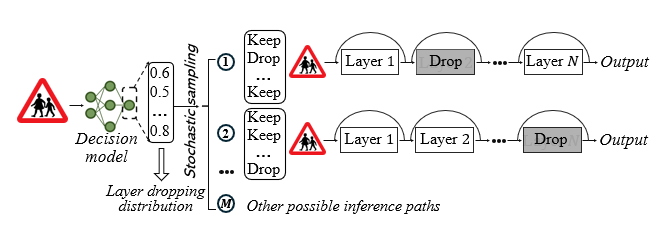

# LeapNet

This is the repo for the EMSOFT2025 “Dynamic Layer Routing Defense for Real-Time Embedded Vision”.

---
### Introduction
This project includes two verisons of dynamic layer routing defense system called LeapNet. 
***LeapNet-1*** focuses on the adversarial security challenge while reducing computational redundancy. 
***LeapNet-2*** further incorporates real-time adaptation to dynamic conditions upon LeapNet-1.


---
### Environments

This projects are tested under the following environment settings:
- OS: Ubuntu 22.04.2
- GPU: Nvidia RTX2080Ti 11GB
- Python: 3.9.18 

It can also be used in other GPUs.
The provided model' weights that used in validation process, are measured in the device with this GPU. 
You can also collect your own latency data and train on your own device.

**(Recommend)** Configure conda environment based on [`environment.yml`](./environment.yml) with the command:

```.bash
 conda env create -f environment.yml
```
And then 
```.bash
 conda activate LeapNet
```

**(Another option)** It is also available to configure the environment based on the [`requirements.txt`](./requirements.txt) with 'pip install -r requirements.txt'. But when using pip install, there are often some packages that cannot be installed and require subsequent manual installation.

---
### Data

We test the system in KUL, GTSRB, cifar10, and tiny-imagenet. The first two datasets can be found in https://drive.google.com/drive/folders/1NgAmfEg5kZ7oc_HThfEUUgwQwTGS8N8U?usp=sharing. The last two datasets would be automatically downloaded when you first run the code.

Additionally, the storage location of each dataset is specified in the corresponding Python file within the dataset folder.
For instance, the default path for the KUL dataset is set to '/data4/zimo/KUL/' in dataset/kul.py.
You can modify this path to match your preferred (downloaded) dataset location.

--- 
### Validation

#### 1. Defense performance 
The trained models LeapNet-1 and LeapNet-2 can be evaluated by running [`eval_leapnet.py`] and [`eval_leapnet-2.py`] which uses [foolbox](https://github.com/bethgelab/foolbox) and [torchattacks](https://github.com/Harry24k/adversarial-attacks-pytorch) for evaluating the adversarial accuracy. Run the command:

For example, if you want to test the adversarial accuracy of LepaNet-2 with resnet34 as the target model under FGSM attack with the maximum perturbation is 0.05, 
you can run the following evaluation commands:
```.bash
python eval_leapnet.py --model resnet34 --dataset kul --batch_size_validation 64 --attack pgd --eps 0.05 --model_path save_models/resnet34_kul_best_LeapNet_1.pt
```
OR
```.bash
python eval_leapnet-2.py --model resnet34 --dataset kul --batch_size_validation 64 --attack fgsm --eps 0.05 --model_path save_models/resnet34_kul_best_LeapNet_2.pt
```
OR
```.bash
python eval_leapnet-2.py --model resnet18 --dataset gtsrb --batch_size_validation 64 --attack fgsm --eps 0.05 --maxlat 2.4 --model_path save_models/resnet18_gtsrb_LeapNet_2.pt
```
You can change the type of attack (fgsm, pgd, bim, square, autoattack) and the maximum perturbation (0-0.06) in the experiment in our paper). This evaluated results can be validated in Fig. 15 and Fig. 14 in our paper.

#### 2. Latency performance 

(1) To validate the effectiveness of latency predictor, 
you can run the following evaluation commands:
```.bash
python latency_prediction.py
```
And 
```.bash
python latency_prediction_prob.py
```
These figures are "latency-prediction-results.jpg" and "latency-prediction-results_prob.jpg" in main directory,
which are the Fig. 11 abd Fig. 12 in our paper.

(2) To validate the adaptability of LeapNet-2 on different latency requirements, 
you can run the following evaluation commands:
```.bash
python eval_lat_leapnet-2.py --model resnet18 --dataset gtsrb --batch_size_validation 1 --model_path save_models/resnet18-gtsrb-LeapNet-2.pt
```
The result figure "latency_result.jpg" is in main directory.
please note that: During the test, the measured latency would not align with the predicted latency,
since the latency-aware capability of this LeapNet-2 is based on my device. 
You can change the tested data file "latency_data.xlsx" with our tested data file [`latency_data_resnet18.xlsx`](./latency_data_resnet18.xlsx) (also in main directory) in Line 271 of eval_lat_leapnet-2.py.
The result is latency_result_example.jpg in main directory, similar to Fig. 18(b) in our paper.
You can change the required latency in Line 63 in eval_lat_leapnet-2.py.

Besides, you can train your own LeapNet-2 based on the following training commands.

---
### Training Commands (optional)

Note: The training process is not a necessary validation. It is just a available choice for you to train your own LeapNet.

First, you need to train a normal target model. 
Using resnet18 on gtsrb dataset as an example, you can run the following evaluation commands:

```.bash
python train.py --data 'gtsrb' --model 'resnet18' --batch_size 256 --batch_size_validation 64 --epochs 30
```

#### 1. LeapNet-1: Only for adversarial robustness optimization.

Training LeapNet-1 example:

```.bash
python train_leapnet.py --data 'gtsrb' --model 'resnet18' --batch_size 256 --batch_size_validation 64 --epochs 30 --entropy_weights 5 --penalty -10
```

Where entropy_weights and penalty are the parameters that affect the training performance of LeapNet-1. 
(more entropy_weights --> more randomness for defense, large penalty --> more clean accuracy. These parameters vary based on the target model and dataset).

Note that the defense performance of LeapNet is based on the target model. 
However, the defense performance of target model varies through different training settings.
Therefore, you need to eval both target model and LeapNet to see the improved performance.

```.bash
python eval.py --model resnet18 --dataset gtsrb --batch_size_validation 64 --attack fgsm --eps 0.05 --model_path save_models/resnet18_gtsrb_best_pretrained.pth
```

```.bash
python eval_leapnet.py --model resnet18 --dataset gtsrb --batch_size_validation 64 --attack fgsm --eps 0.05 --model_path save_models/resnet18_gtsrb_best_LeapNet_1.pth
```

#### 2. LeapNet-2: Considering to maintain randomness for adversarial robustness while maintain dynamic latency requirements of mobile devices.

(1) Measure latency for different layer dropping on your device for further training latency predictor:
 
   Run the following evaluation commands (default as resnet18);

   ```.bash
   python latency_measurement.py
   ```

   You need to collect multiple times for constructing a lateny-related dataset. The example data reference to [`policy_inference_data_resnet18.xlsx`](./SkipMTD/latency_predictor/policy_inference_data_resnet18.xlsx)

(2) Build the latency predictor 

   Run the following evaluation commands (default as resnet18);

```.bash
python latency_prediction_v2.py
```
Please take care and change the following three information to your own: ***i***. Input data name:raw_data = pd.read_excel("./policy_inference_data_resnet18.xlsx", converters={"policy": str})
***ii***. Output predictor's weight name: "torch.save(model.state_dict(), "./latency_predictor_resnet18.pth.tar")".  ***iii***. The input size of Predictor in Line 107 (default as 8 for resnet18, change to 16 for resnet34)

You need to evaluate the performance of the trained predictor before training LeapNet-2,
based on 2.(1) in the previous Validation section.

(3) Training LeapNet-2 example

```.bash
python train_leapnet-2.py --data 'gtsrb' --model 'resnet18' --batch_size 256 --batch_size_validation 64 --epochs 40 --entropy_weights 1 --penalty -10 --iternum 2 --model_path save_models/resnet18_gtsrb_best_pretrained.pth
```

Note that larger "entropy_weights" degrades the latency performance, more "iternum" means more weight on latency loss.

## License

This project is licensed under the MIT License.  
For details, please refer to the [MIT License terms](https://opensource.org/licenses/MIT).

## Please Cite

Please cite this work as follows:

```bibtex
@article{ma2025dynamic,
   title={Dynamic layer routing defense for real-time embedded vision},
   author={Ma, Zimo and Luo, Xiangzhong and Song, Qun and Tan, Rui},
   journal={ACM Transactions on Embedded Computing Systems},
   volume={24},
   number={5s},
   pages={1--26},
   year={2025},
   publisher={ACM New York, NY}
}
```


